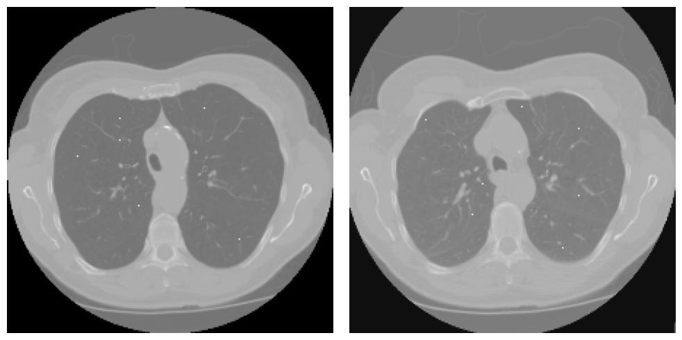

# CT registration challenge
This repository contrains source code and the report for the COPD lung CT registration challenge. It was the final assignment for the **Medical Image Registration and Analysis** course at the University of Girona for the [MAIA programme](https://maiamaster.udg.edu/).

||
| :--: | 
| *Images used for registration. Inhale on the left, exhale on the right with the landmark points plotted over the original image (white dots). Case image 1, transversal view, left-inhale, right-exhale* |

**Proposed solution was awarded with the third place and reached a mean TRE of 1.423 mm on the test dataset on the challenge day.**
<center> <h3> <a href=MIRA_final_project.pdf>Link to the Report </a></h3></center>

___
## Authors
Alejandro Cortina Uribe [github](https://github.com/alexCortinaU) | [linkedin](https://www.linkedin.com/in/acortinau/)

Vladyslav Zalevskyi [github](https://github.com/Vivikar) | [linkedin](https://www.linkedin.com/in/vlad-zalevskyi/)
___
## Challenge description

>In this project, we implemented and tested different approaches to register lung CT scans (inhale and exhale) from the DIR Lab COPDGene dataset. The first one consisted of an intensity-based image registration algorithm, using a normalized correlation criterion with an optimization procedure. By using Elastix, we combined an affine and two nonrigid B-spline transformations in a multi-resolution framework. We achieved a mean target registration error (TRE) of 1.5816 ± 0.64 mm, for the dataset cases COPD1 to COPD4. The second approach consisted of using a pre-trained deep learning model based on SynthReg. From the original model, which was trained in a contrast-agnostic manner, we adapted the sm-shapes instance which we used to obtain a deformation map. With this model, we obtained a mean TRE of 15.224 ± 4.096 mm for the same cases. Finally, we implemented an automated registration pipeline using the first approach, which was used on the day of the challenge to register three new test cases (COPD0, COPD5, and COPD6). On said challenge day, we obtained a mean TRE of 1.423 mm.
___

## To run the Elastix registration pipeline for COPD cases:
1. Make sure you have the envioronment copy set up
```
conda create --name myenv --file env-spec-file.txt
```
2. You will need to have a directory called ```paramMaps``` in the location ```data/copd/paramMaps```. Three files must be there:
- Parameters.Par0011.affine.txt
- Parameters.Par0011.bspline1_s.txt
- Parameters.Par0011.bspline2_s.txt

3. You will need to save your Dir-Lab COPDgene **test** images in the test_data folder. These will need to be:

- inhale image (nii.gz)
- exhale image (nii.gz)
- inhale landarmks (.txt)

4. From the repository directory, run the file ```register.py```:
```
python register.py fixed_image_path moving_image_path fixed_image_points_path
```
5. The resulting files will be saved in the ```test_data``` folder:
- inhale lung mask (_lm.nii.gz)
- exhale lung mask (_lm.nii.gz)
- exhale lung mask transformed (_lm_transformed.nii.gz)
- transformed inhale points (transformed_points.txt)
___
## To run the SynthReg registration pipeline for COPD cases
### 1. Use the same environment as for Elastix

### 2. Ensure that you have the data and it is in theright format. You can download it with the following commands:

1. Run 
```
cd data/

gdown --folder 1yHWLQEK9c1xzggkCC4VX0X4To7BBDqu5 # for EMPIRE Data

curl https://zenodo.org/record/3835682/files/training.zip?download=1 --output learn2reg.zip # for Learn2Reg Data

gdown --folder 1cARJcCKWtGP44p3e0X4Umpf_ISB-64lC # for our 4 COPD train cases
```

The resulting directory structure should look like this:

```
.
└── data
    └── learn2reg
        ├── keypoints
│       │   ├── case_001.csv
│       │   ├── case_002.csv
│       │   ├── ..........
        ├── lungMasks
│       │   ├── case_001_exp.nii.gz
│       │   ├── case_001_insp.nii.gz
│       │   ├── case_002_exp.nii.gz
│       │   ├── case_002_insp.nii.gz
│       │   ├── ..........
        └── scans
│       │   ├── case_001_exp.nii.gz
│       │   ├── case_001_insp.nii.gz
│       │   ├── case_002_exp.nii.gz
│       │   ├── case_002_insp.nii.gz
│       │   ├── ..........
```
After the data is in the right format run the script to fix train/val splits
```
$ python data/fix_train_partitions.py
```

### 3. To run SynthMorph predictions for COPD cases:
1. Preprocess the data by ensuring directory structure as described above

2. Run the following script to preprocess the data
```$ python data/preprocess_data.py```

3. For each new image resolution rebuild the model using
```$ python synthmorph/convert_tf2torch.py```  
and chaning inside the file the resolution to the input image. For now the COPD is resized to (224, 224, 96)
4. Run ```$ python synthmorph/predict_flow.py``` to get the deformation field matrix for each case
5. Run ```$ python synthmorph/transform_kps.py``` to transform keypoints to the new space for each case and calculate resulting TRE.

___